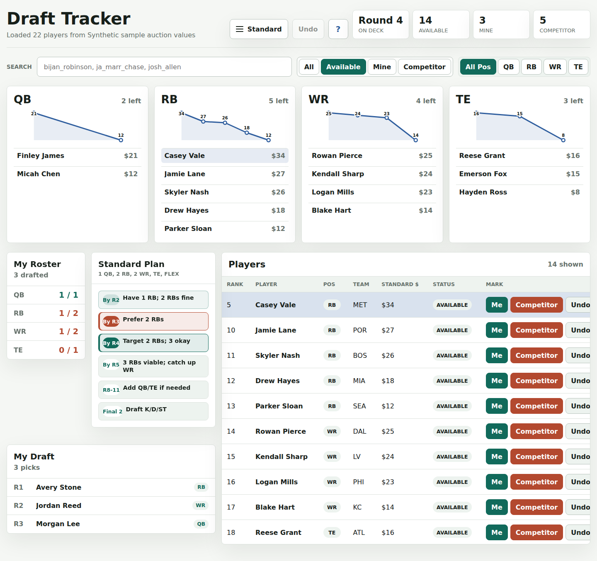
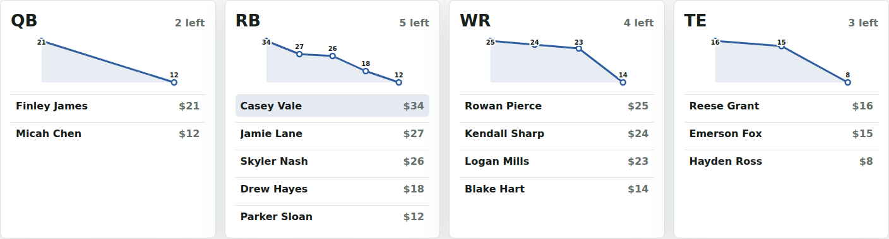
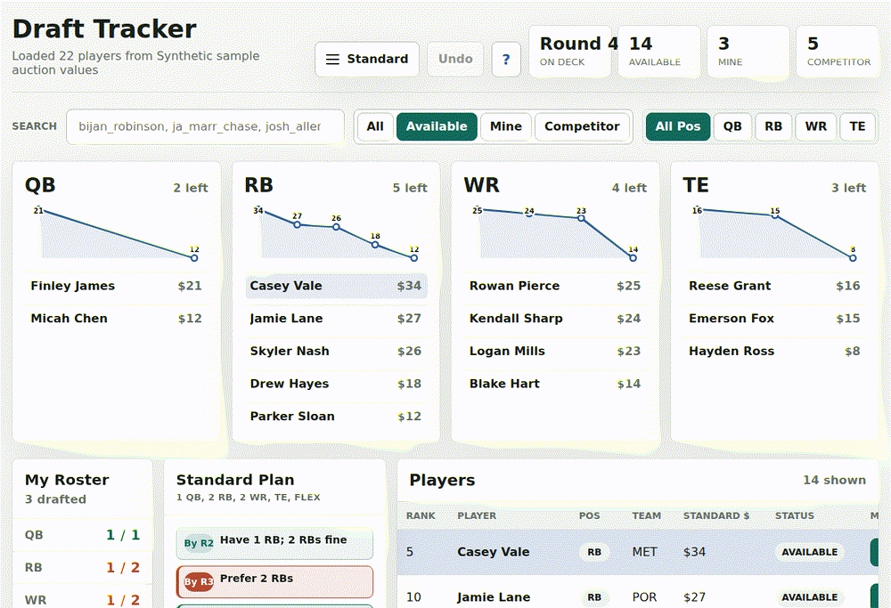
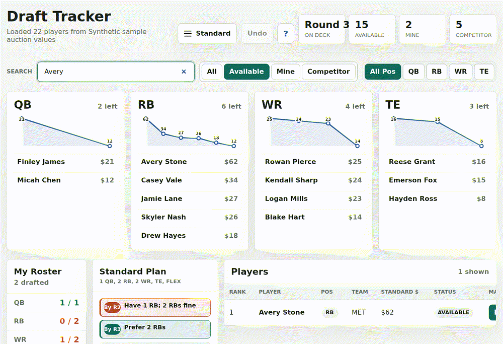
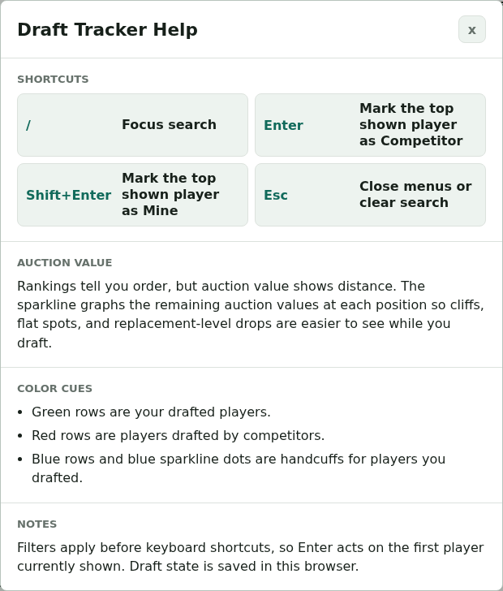

# Draft Tracker

A browser-based fantasy draft tracker built around auction value. It loads a local CSV, tracks drafted players in browser storage, highlights handcuffs, and graphs remaining auction-value cliffs by position.



## Why This Tracker

Most draft trackers center on rank order. Draft Tracker centers on auction value, because auction value shows the size of the gap between players. The position sparklines make cliffs, flat spots, and replacement-level drops easier to spot during a live draft.



## Fast Live Drafting

The fastest shortcut is optimized for the thing you do most often during a draft: logging another team's pick. Search narrows the table, then `Enter` marks the top shown player as a competitor pick. `Shift+Enter` is reserved for the more deliberate action of marking your own pick.



## Handcuff Awareness

When you draft a player, available backups on the same team and at the same position are highlighted in blue. That cue appears in the player list, the position top-five list, and the sparkline dot.



## Built-In Help

The `?` button shows keyboard shortcuts, the auction-value concept, color cues, and browser-storage behavior without leaving the draft board.



## Local Setup

Run the folder through a local static server so the browser can fetch the CSV:

```sh
python3 -m http.server 8001
```

Then open:

```text
http://127.0.0.1:8001/index.html
```

## Data Source Config

This app expects a local `data-source-config.js` file, but that file is intentionally source-specific. If your CSV comes from a third party or contains licensed/proprietary headers, do not publish that config or the CSV.

To configure your own data source:

1. Copy `data-source-config.template.js` to `data-source-config.js`.
2. Put your CSV file in this folder.
3. Set `csvUrl` to that CSV filename.
4. Map each canonical app field to the matching CSV header.
5. Add one or more scoring modes with an auction-value header and rank header.

Some config values are a contract with the CSV. Others are app-facing names you choose:

| Value | Must match CSV? | Notes |
| --- | --- | --- |
| `csvUrl` | Yes | Exact local CSV filename. |
| `fields.playerId` | Yes | Exact header for a stable unique player id. This powers saved draft state. |
| `fields.firstName`, `fields.lastName`, `fields.fallbackName` | Yes | Exact name headers. Use `fallbackName` if the CSV has a full-name column. |
| `fields.team`, `fields.position` | Yes | Exact headers for team and position. |
| `scoringModes[].auctionValue` | Yes | Exact auction-value header. Required for this app to be useful. |
| `scoringModes[].rank` | Yes | Exact rank/order header for sorting within that scoring mode. |
| `scoringModes[].fallbackRank` | Yes, if used | Exact backup rank header. Remove it if you do not need one. |
| `sourceLabel` | No | Display text shown after the CSV loads. |
| `scoringModes[].key` | No | Internal id you choose, but keep it stable because browser settings use it. |
| `scoringModes[].label` | No | Display text shown in the scoring menu and value column. |

Example shape:

```js
window.DataSourceConfig = {
  csvUrl: "my-values.csv",
  sourceLabel: "My 2026 auction values",
  fields: {
    playerId: "id",
    firstName: "first",
    lastName: "last",
    fallbackName: "name",
    team: "team",
    position: "position",
  },
  scoringModes: [
    {
      key: "standard",
      label: "Standard",
      auctionValue: "standard_value",
      rank: "standard_rank",
    },
  ],
};
```

If a value can come from multiple possible headers, use an array. The app will use the first non-empty value:

```js
team: ["team_abbreviation", "team_name"]
```

## Publish Notes

For a public GitHub repo, include:

- `index.html`
- `app.js`
- `styles.css`
- `draft-plan-config.js`
- `draft-helpers.js`
- `data-source-config.template.js`
- `assets/`
- `scripts/`
- `package.json`
- `package-lock.json`
- `README.md`

Do not include:

- `data-source-config.js`
- third-party CSV exports
- `node_modules/`
- lock/temp files created by spreadsheet editors

## Screenshot Capture

The screenshot script uses Playwright and synthetic sample data, so generated README images do not expose your private CSV or source-specific config.

Install dependencies once:

```sh
npm install
npx playwright install chromium
sudo apt install ffmpeg
```

If Chromium reports missing Linux libraries, run this in your own terminal so sudo can prompt for your password:

```sh
npx playwright install-deps chromium
```

Then capture screenshots:

```sh
npm run capture:screenshots
```

The script writes images to `assets/`:

- `hero-dashboard.png`
- `auction-value-cliffs.png`
- `handcuff-highlight.png`
- `keyboard-shortcuts-help.png`
- `competitor-logging.gif`
- `handcuff-highlight.gif`
- `help-dialog.gif`
